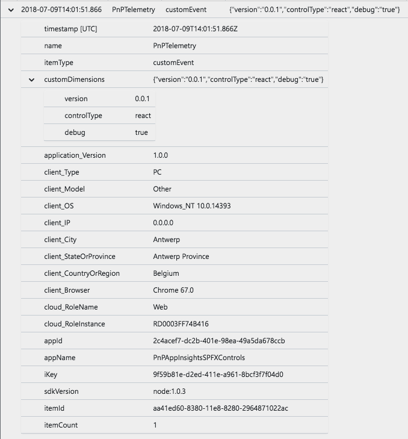

# PnP Node.js based telemetry proxy for Application Insights

In this repository, you can find the code of the PnP Telemetry API. This API has been created in order to track usage of the client-side PnP libraries like [@pnp/spfx-controls-react](https://github.com/SharePoint/sp-dev-fx-property-controls) and [@pnp/spfx-property-controls](https://github.com/SharePoint/sp-dev-fx-controls-react).

Initially, the projects made use of Application Insights, but over time it appeared that Application Insights does not yet support multiple configurations and/or account keys. Because it is not supported, it prevents other developers from adding Application Insights to their own project, or the PnP Application Insights filters get overwritten.

The data you send to the proxy will be added to the PnP Application Insights account and is running on the following API endpoint: `https://pnptelemetryproxy.azurewebsites.net/track`.

> Info: This project is intended to show to you what is actually running behind our tracking API.

## What are we tracking

We only track usage from the PnP client-side libraries, this could contain for instance which control and dependency version you are using. 

The IP address is only used for the geolocation, but Application Insights does not store this. It will be logged as `0.0.0.0`.

Your browser its user agent is being tracked in order to know the most used browser. 

Here is a sample of an Application Insights record:

## Have issues or questions?

Please use following logic on submitting your questions or issues to right location to ensure that they are noticed and addressed as soon as possible.

* You have general question or challenge with SPFx - use [sp-dev-docs repository issue list](https://github.com/sharepoint/sp-dev-docs/issues).
* You have issue on specific controls in this package - use [issue list in this repository](https://github.com/pnp/telemetry-node-proxy/issues).

### Contributing

This project welcomes contributions and suggestions.  Most contributions require you to agree to a
Contributor License Agreement (CLA) declaring that you have the right to, and actually do, grant us
the rights to use your contribution. For details, visit https://cla.microsoft.com.

When you submit a pull request, a CLA-bot will automatically determine whether you need to provide
a CLA and decorate the PR appropriately (e.g., label, comment). Simply follow the instructions
provided by the bot. You will only need to do this once across all repos using our CLA.

This project has adopted the [Microsoft Open Source Code of Conduct](https://opensource.microsoft.com/codeofconduct/).
For more information see the [Code of Conduct FAQ](https://opensource.microsoft.com/codeofconduct/faq/) or
contact [opencode@microsoft.com](mailto:opencode@microsoft.com) with any additional questions or comments.

### "Sharing is Caring"

### Disclaimer

**THIS CODE IS PROVIDED *AS IS* WITHOUT WARRANTY OF ANY KIND, EITHER EXPRESS OR IMPLIED, INCLUDING ANY IMPLIED WARRANTIES OF FITNESS FOR A PARTICULAR PURPOSE, MERCHANTABILITY, OR NON-INFRINGEMENT.**